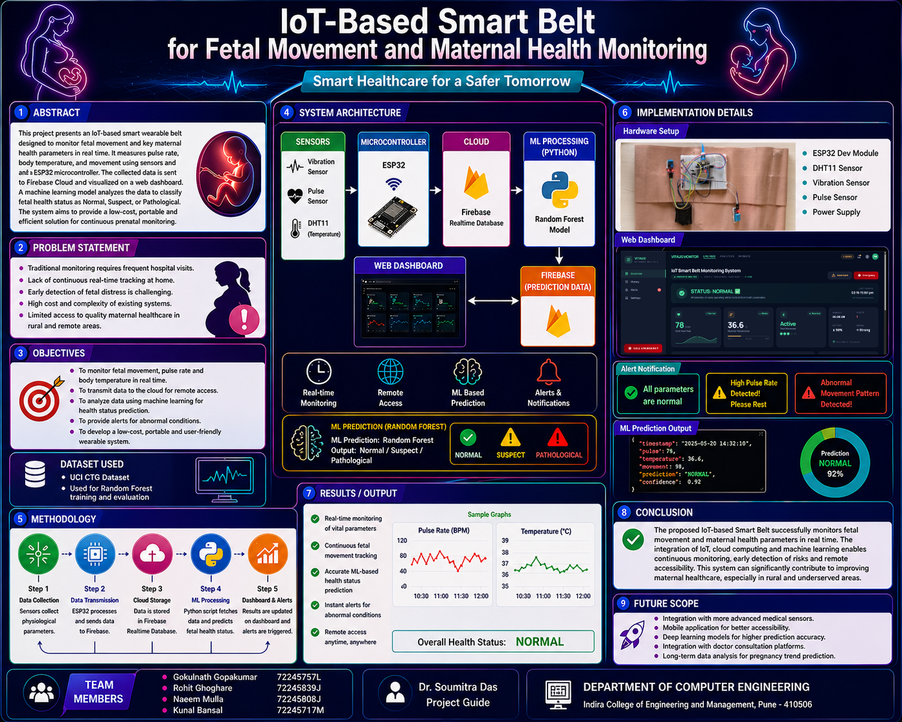
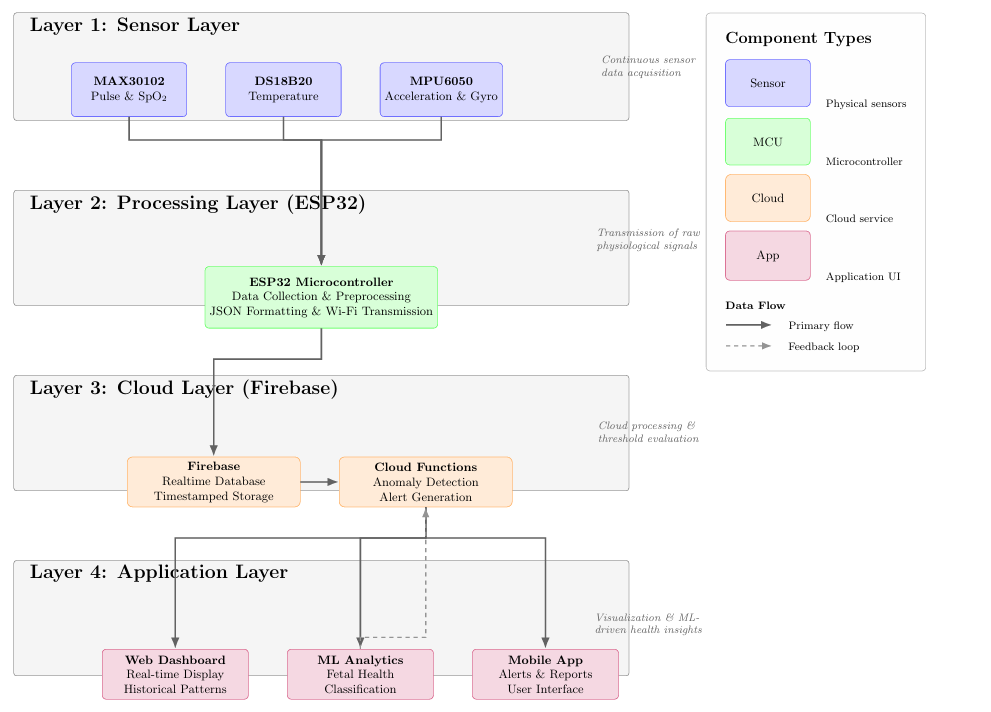
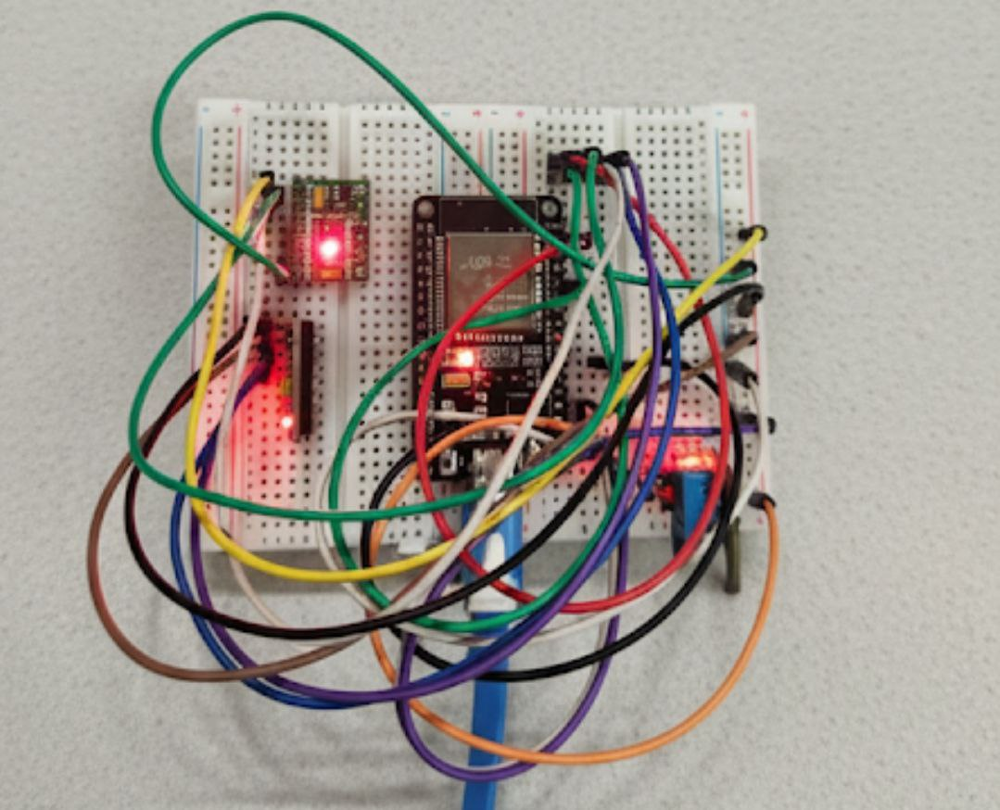
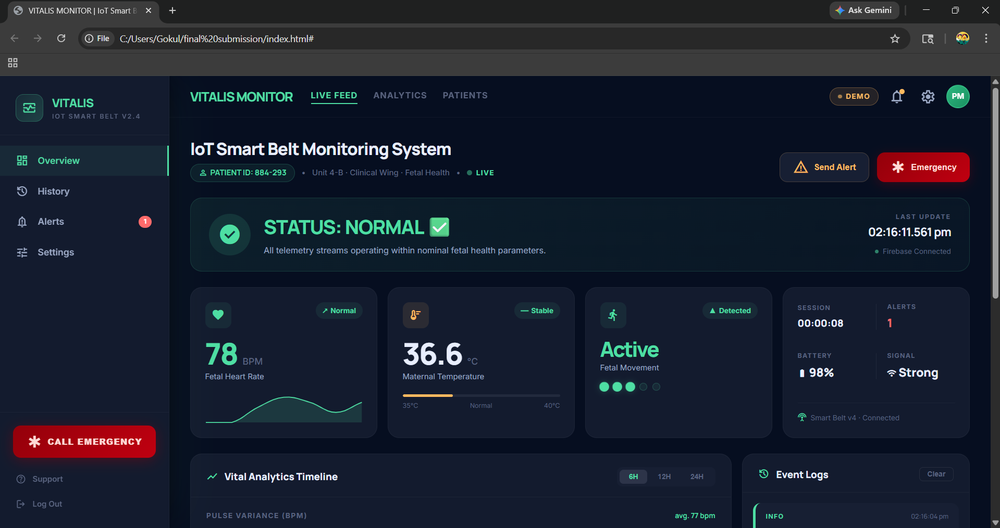
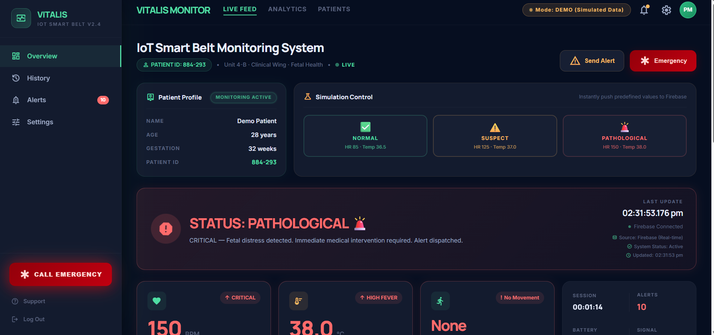
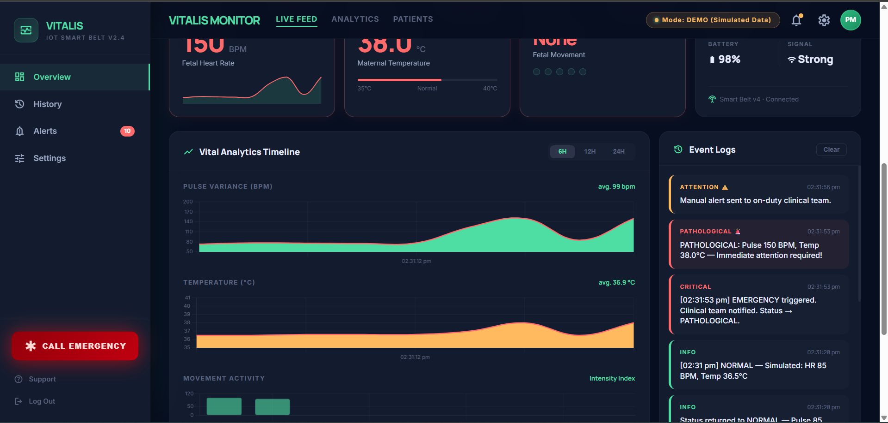
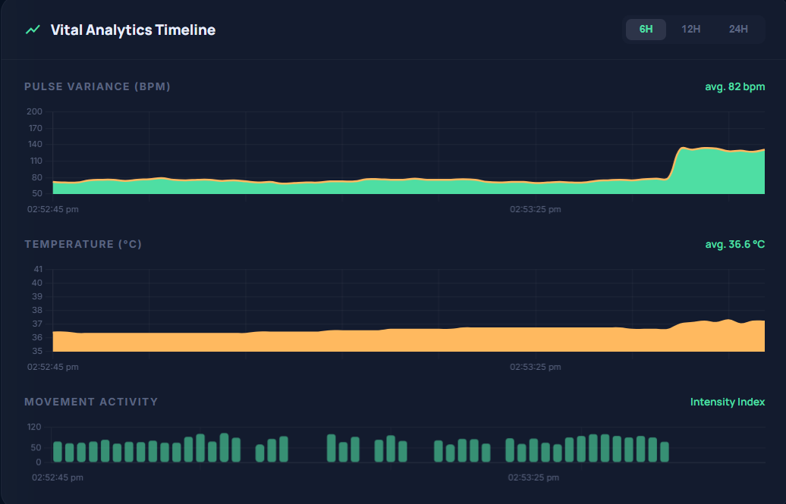
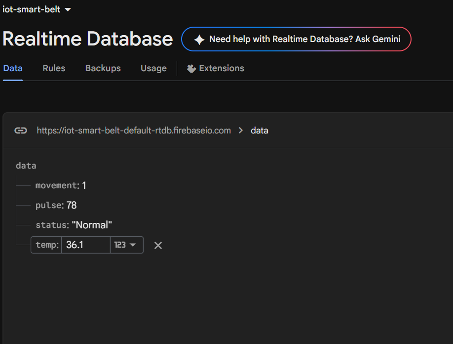
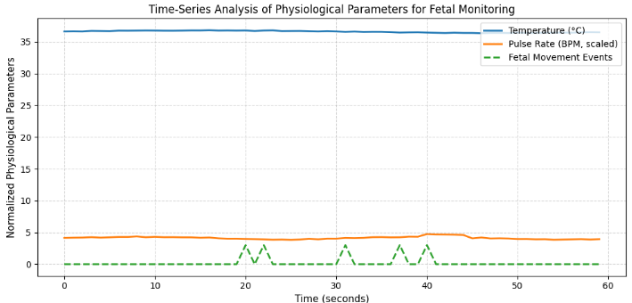
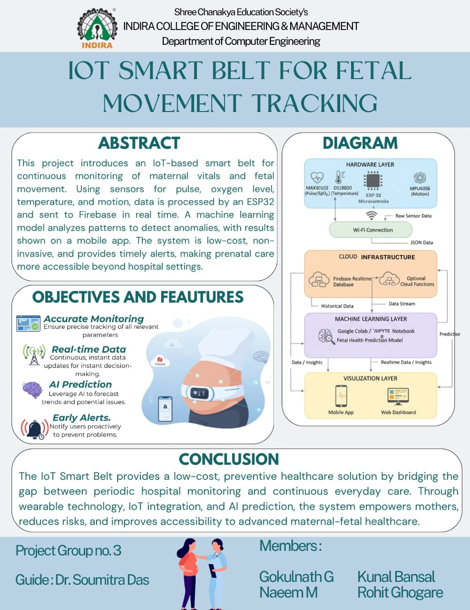

# IoT Smart Belt — Fetal Movement & Maternal Health Monitor

A wearable IoT prototype that combines **ESP32**, **Firebase Realtime Database**,
**Random Forest ML**, and a live dashboard for continuous maternal health monitoring.

  

---

## Overview

Undetected changes in fetal movement or maternal vitals during pregnancy can escalate quickly. This project presents an IoT-enabled wearable belt that acquires physiological data, streams it to the cloud, runs machine learning inference, and surfaces results through an interactive dashboard — all in real time.

The system integrates hardware sensing, cloud computing, and ML into a single modular architecture suited for academic demonstration and future clinical extension.

> **Note:** The prototype combines live sensor acquisition with controlled simulation during demonstrations to validate the full cloud, dashboard, and ML workflow end-to-end.

---

## Features

- Continuous pulse, temperature, and fetal movement sensing via ESP32
- Firebase Realtime Database for low-latency cloud sync
- Random Forest classifier for automated health status prediction
- Interactive web dashboard with live physiological graphs
- Modular, scalable architecture

---

## System Architecture

Pulse Sensor ─┐

Temp Sensor  ─┼─► ESP32 ──► Firebase RTDB ──► Python (Random Forest)

Vibration    ─┘                                       │

Prediction

│

Firebase RTDB

│

Dashboard (graphs · alerts · status)

  

---

## Technology Stack

| Layer | Technology |
|-------|------------|
| Hardware | ESP32, DHT11 (temperature), SW-420 (vibration), pulse sensor |
| Cloud | Firebase Realtime Database |
| Machine learning | Python, Scikit-learn, Random Forest |
| Frontend | HTML, CSS, JavaScript |
| Tooling | Arduino IDE, VS Code, Google Colab |

---

## Repository Structure

iot-smart-belt-fetal-monitoring/

├── dashboard/       # Web frontend

├── docs/            # Reports, posters, research paper

├── firebase/        # Firebase config and rules

├── hardware/        # ESP32 firmware (Arduino)

├── ml_model/        # Training scripts and saved model

├── screenshots/

├── README.md

└── LICENSE

---

## Screenshots

### Hardware prototype

| Semester VII | Semester VIII |
|---|---|
|  |  |

### Dashboard

### Firebase Realtime Database

### Physiological data graphs

## 📌 Project Posters

### Semester VII Poster

  

---

### Semester VIII Poster

  

---

## ML Pipeline

The Python inference module polls Firebase for the latest sensor readings, runs prediction using the trained Random Forest model, and writes the result back to Firebase. The dashboard subscribes to these updates and reflects the new status automatically — no manual refresh needed.

Firebase RTDB

│

Python inference script

(loads trained .pkl model)

│

Health status prediction

│

Firebase RTDB  ──►  Dashboard

---

## Results

| Outcome | Status |
|---------|--------|
| Real-time sensor acquisition (ESP32) | ✅ |
| Cloud sync via Firebase | ✅ |
| ML health status classification | ✅ |
| Live dashboard with graphs | ✅ |
| Automated alerts | ✅ |

---

## Documentation

| Document | Description |
|----------|-------------|
| Project report | Full implementation, methodology, and results |
| Research paper | Published in IRJMETS |
| Semester VII poster | Initial prototype presentation |
| Semester VIII poster | Final implementation poster |

---

## Future Scope

- Mobile app for remote monitoring and push alerts
- Edge AI inference directly on the ESP32 (TensorFlow Lite)
- Medical-grade sensor integration
- Clinical validation with real-world datasets
- Multi-patient cloud dashboard with analytics

---

## Team

| Name |
|------|
| Gokul Gopakumar |
| Rohit Ghoghare |
| Naeem Mulla |
| Kunal Bansal |

**Guide:** Dr. Soumitra Das — Department of Computer Engineering, Indira College of Engineering and Management

---

## Disclaimer

This is an academic prototype developed for educational and research purposes. It is **not intended to replace professional medical equipment or clinical diagnosis.** Some demonstrations use controlled simulation to validate the complete cloud and ML pipeline.

---

## License

MIT License
